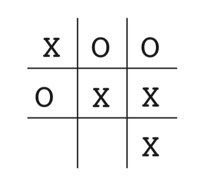
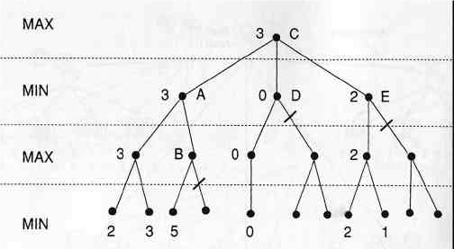

# TicTacToe-AI
An implementation of **Minimax AI Algorithm** configured with **alpha beta pruning** on Tic-Tac-Toe (Noughts and Crosses) game.

 

## Table of Contents
1. [Minimax?!](#minimax)
2. [Alpha-Beta Pruning!](#alpha-beta-pruning)

## Minimax?!
Minimax is a kind of backtracking algorithm that is used in decision making and game theory to find the optimal move for a player, assuming that your opponent also plays optimally. It is widely used in two player turn-based games such as Tic-Tac-Toe, Backgammon, Mancala, Chess, etc.  
In Minimax the two players are called **maximizer and minimizer**. The maximizer tries to get the highest score possible while the minimizer tries to do the opposite and get the lowest score possible.  
Every board state has a value associated with it. In a given state if the maximizer has upper hand then, the score of the board will tend to be some positive value. If the minimizer has the upper hand in that board state then it will tend to be some negative value. The values of the board are calculated by some heuristics which are unique for every type of game.

## Alpha-Beta Pruning!
Alpha-Beta pruning is not actually a new algorithm, rather an optimization technique for minimax algorithm. It reduces the computation time by a huge factor. This allows us to search much faster and even go into deeper levels in the game tree. It cuts off branches in the game tree which need not be searched because there already exists a better move available. It is called Alpha-Beta pruning because it passes 2 extra parameters in the minimax function, namely alpha and beta.  
**Alpha** is the best value that the maximizer currently can guarantee at that level or above.  
**Beta** is the best value that the minimizer currently can guarantee at that level or above.  

